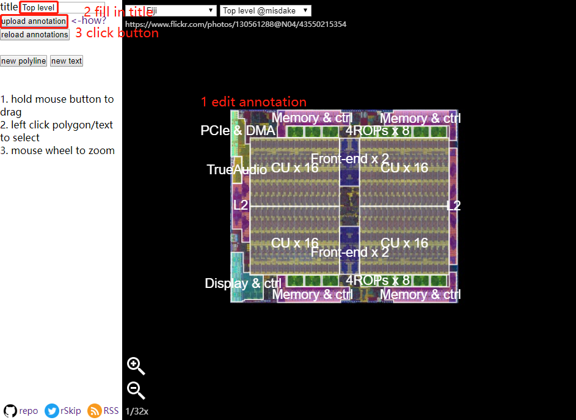
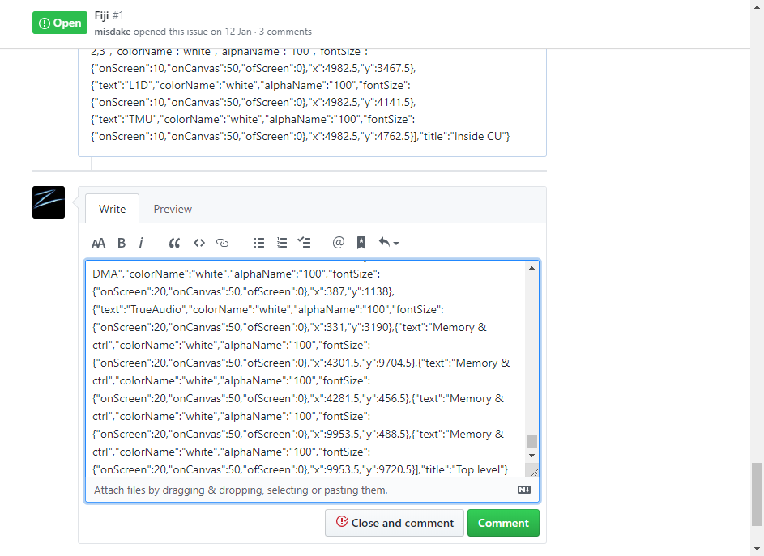
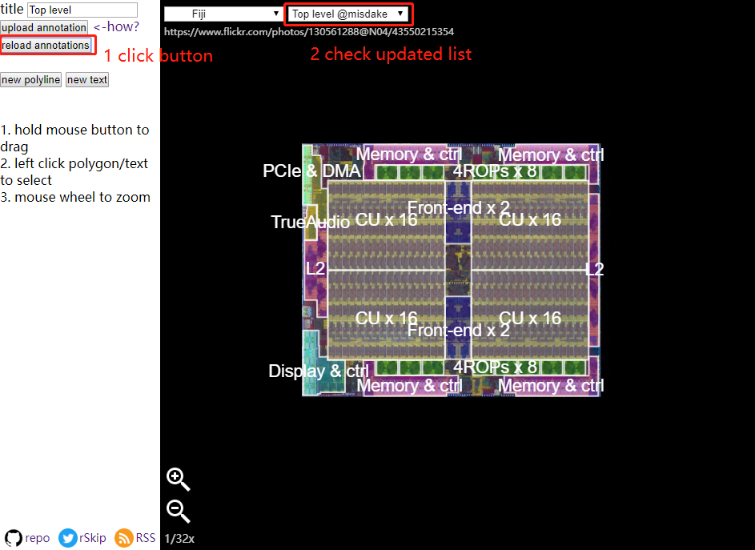
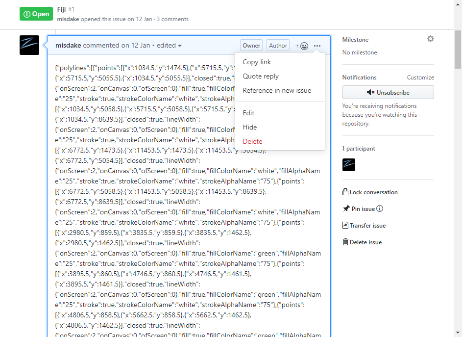
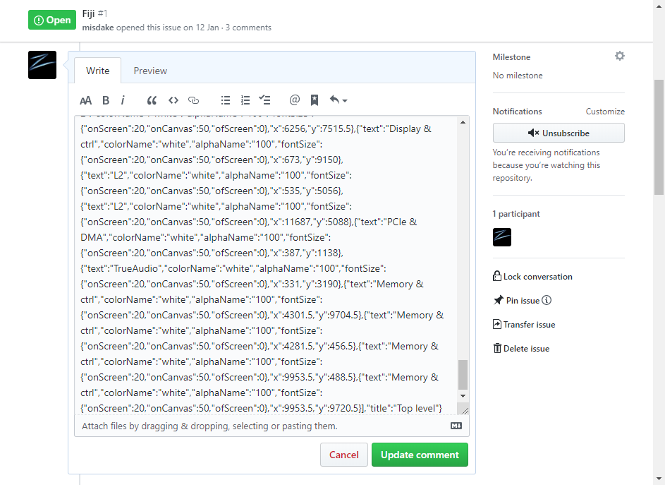

# How to contribute annotation

## a. Edit

1. Open and edit annotation
2. Fill in title
3. Click "upload annotation" button

## b. Upload

Annotations are stored in Github Issues. To upload, a github account is needed.

If you are not logged in, please sigh up or login and then proceed.

1. After clicking "upload annotation" button, it will copy annotation info to clipboard, and open up a github issue page
2. Scroll down to bottom
3. Paste clipboard into comment text field (note that annotation info is already copied)
4. Click "Comment" button to upload annotation to github

## c. Refresh List

1. Go back and click "reload annotation" button, the list will be reloaded
2. Then you can select the newly uploaded annotation, and maybe share the link with others

## d. Edit uploaded Annotation (just in case)

1. (Same as [a]) Edit annotation as you want, click "Upload Annotation" button
2. Github issue page will scroll to the specific comment corresponding to this annotation
3. Click the "..." button and select "Edit" to edit

## e. Update

1. Paste clipboard into comment text field
2. Click "Update comment" to update it